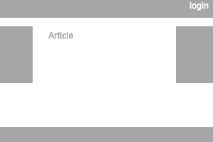

# HTML Test

Write the html/css code of a page with:

1. Fluid width
2. Header with height 100px
3. Login button at the right corner of header
4. Left-side and Right-side panels with 100px width and 200px height
5. Center panel for the article text
6. Footer, which always will be at the bottom. Even if article is 1 line long.

Here's what it should look like:

PS: Don't use tables :)
